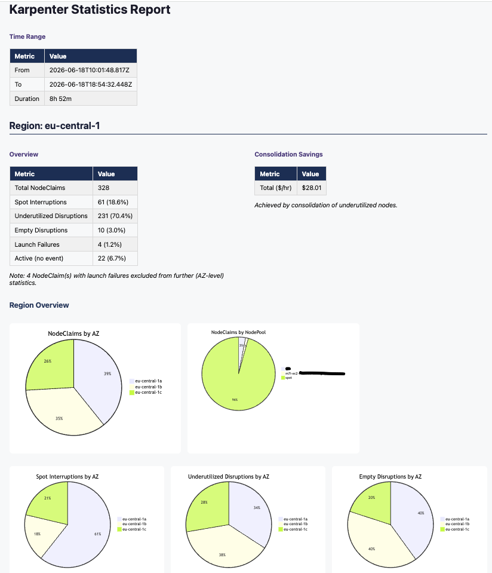
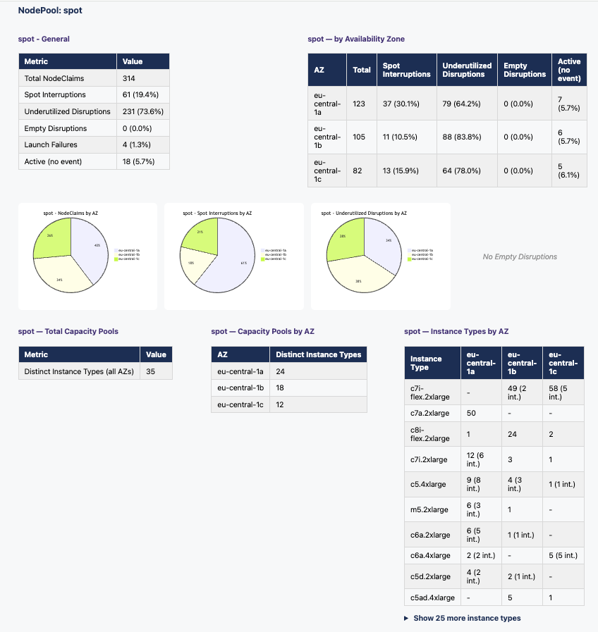
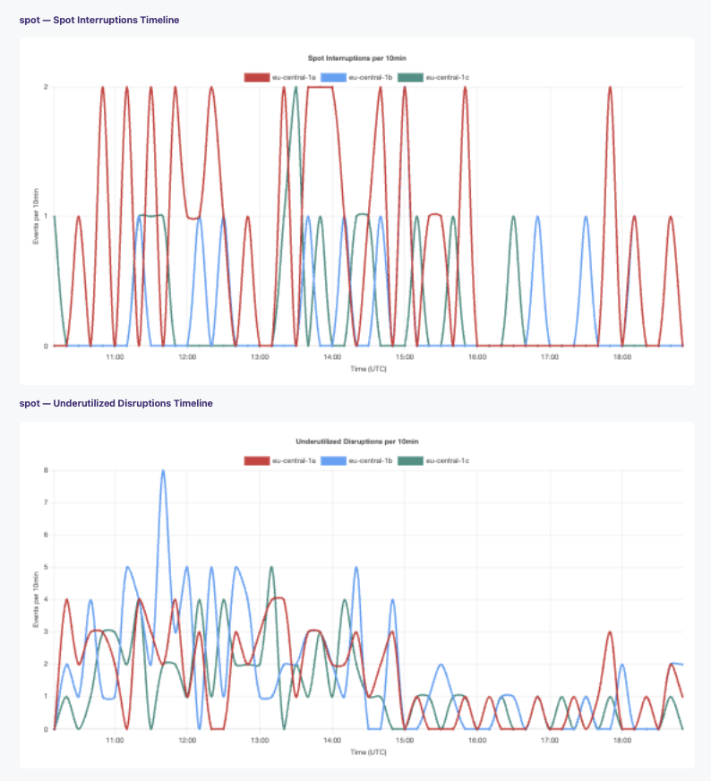
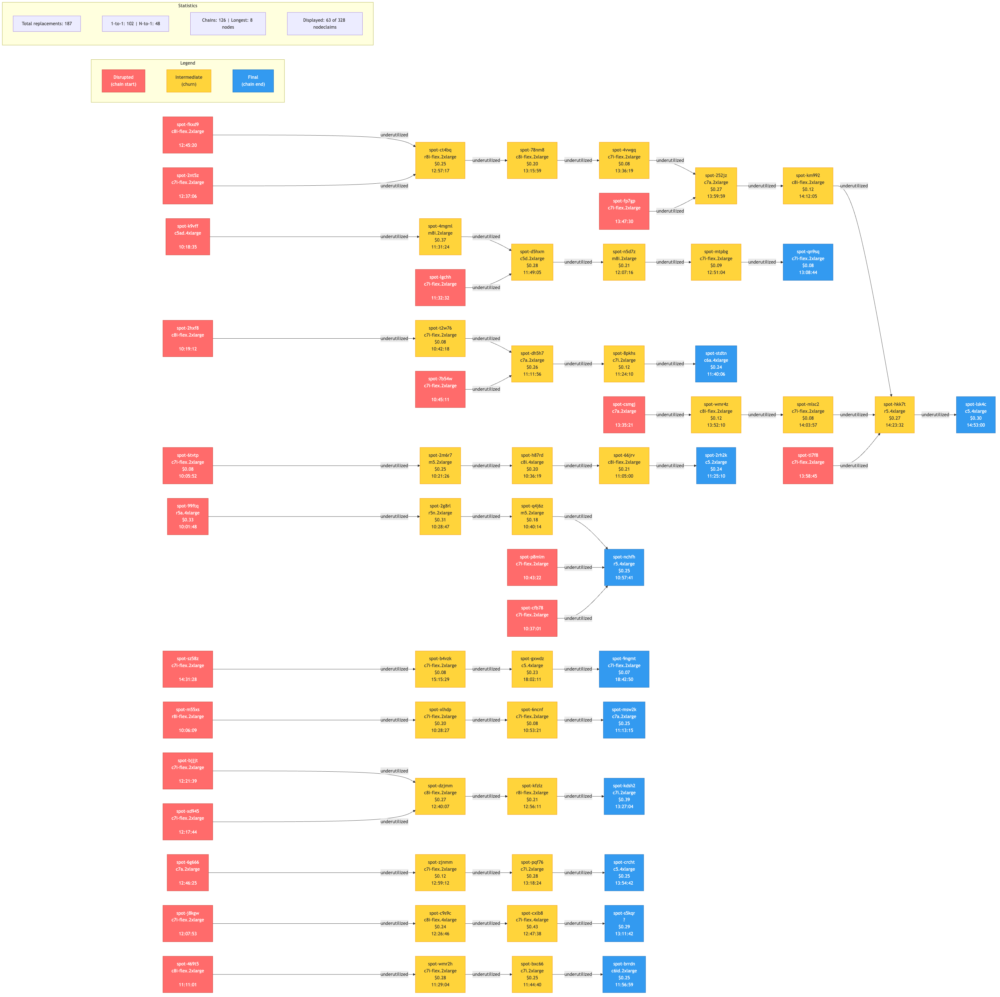

# Log Parser for Karpenter (LogParserForKarpenter)

  
----

**Log Parser for Karpenter** is a Golang based command line tool which can parse the output of Karpenter Controller logs, tested against logs from Karpenter versions:
* v0.37.7 \*
* v1.0.x \*
* v1.1.x
* v1.2.x
* v1.3.x
* v1.4.x
* v1.9.0
* v1.13.0

\* Note: `"messageKind":"spot_interrupted"` is first supported with Karpenter version v1.1.x, so **LogParserForKarpenter (lp4k)** does not provide *interruptiontime* and *interruptionkind* in earlier versions

It allows using either STDIN (for example for piping live Karpenter controller logs) or multiple Karpenter log files as input and will print CSV style formatted output of nodeclaim data ordered by createdtime to STDOUT, so one can easily redirect it into a file and analyse with tools like [lp4kchain](#lp4kchain), [lp4kstats](#lp4kstats), [Amazon QuickSight](https://docs.aws.amazon.com/quicksight/latest/user/welcome.html) or Microsoft Excel.

**lp4k** supports two input formats which are automatically detected:
1. **Plain text** — raw Karpenter controller log output (one JSON log line per line)
2. **JSON array** — Grafana/Loki log export format (a JSON array of objects, each requiring a `"line"` field with the raw Karpenter log line and a `"date"` field for chronological sorting)

No flags are needed — the format is detected automatically for both file arguments and STDIN input.

**Options:**

| Flag | Default | Description |
|---|---|---|
| `--start` | (none) | Filter: only parse log lines at or after this ISO 8601 timestamp |
| `--end` | (none) | Filter: only parse log lines at or before this ISO 8601 timestamp |
| `--kubeconfig` | `~/.kube/config` | Path to kubeconfig file (env: `KUBECONFIG`) |
| `--context` | (none) | Kubernetes context to use (env: `LP4K_K8S_CONTEXT`) |

```bash
# Parse only events between 12:00 and 14:00
./bin/lp4k --start 2026-06-18T12:00 --end 2026-06-18T14:00 karpenter-logs.json

# Parse everything from 16:00 onwards
cat karpenter-logs.json | ./bin/lp4k --start 2026-06-18T16:00
```

If neither STDIN nor log files are used as input, **lp4k** will attach to a running K8s/EKS cluster and parses Karpenter logs (streamed logs, similar to *kubectl logs -f* using LP4K_KARPENTER_NAMESPACE and LP4K_KARPENTER_LABEL) and creates a ConfigMap *lp4k-cm-\<date\>* in same namespace, which gets updated every LP4K_CM_UPDATE_FREQ.

K8s handling can be configured using the following OS environment variables:

| Environment variable      | Default value     | Description
| ------------- | ------------- | ------------- |
| LP4K_K8S_CONTEXT | "" (current-context) | Kubernetes context to use from kubeconfig (useful with multiple clusters or tools like [kubie](https://github.com/kubie-org/kubie))
| LP4K_KARPENTER_NAMESPACE | "kube-system" | K8s namespace where Karpenter controller is running
| LP4K_KARPENTER_LABEL | "app.kubernetes.io/name=karpenter" | Karpenter controller K8s pod labels
| LP4K_CM_UPDATE_FREQ | "30s" | update frequency of ConfigMap and STDOUT if enabled (default), must be valid Go time.Duration string like "30s" or 2m30s"
| LP4K_CM_PREFIX | "lp4k-cm" | nodeclaim ConfigMap prefix, if KARPENTER_LP4K_CM_OVERRIDE=false or ConfigMap name, if KARPENTER_LP4K_CM_OVERRIDE=true
| LP4K_CM_OVERRIDE | "false" | determines, if ConfigMap will just use prefix and will be overriden upon every start of lp4k
| LP4K_NODECLAIM_PRINT | "true" | print nodeclaim information every KARPENTER_CM_UPDATE_FREQ to STDOUT
| LP4K_TIME_FORMAT | "2006-01-02-15-04-05" | time format for ConfigMap names and S3 object timestamps, must be a valid Go time layout string

\* Note: In mode `LP4K_CM_OVERRIDE=true` **lp4k** will read existing nodeclaim data from ConfigMap specified by LP4K_CM_PREFIX

### Nodeclaim Replacement Tracking

When Karpenter performs consolidation with `decision: "replace"` (Karpenter >= 1.x), the disrupted nodeclaim(s) are replaced by a new one. **lp4k** tracks this relationship via the `reconcileID` field in the logs and exposes two CSV columns:

| Column | Description |
|---|---|
| `Replacedby` | On the disrupted nodeclaim: name of its replacement nodeclaim |
| `Replaces` | On the replacement nodeclaim: pipe-delimited name(s) of the disrupted nodeclaim(s) it replaces |

This covers both 1-to-1 replacements and N-to-1 consolidations. For older Karpenter versions that only use `decision: "delete"`, these columns remain empty.

### S3 Upload Configuration

**lp4k** can automatically upload parsed Karpenter log data to Amazon S3. This feature is optional and only enabled when the S3 bucket environment variable is set.

| Environment variable      | Default value     | Description
| ------------- | ------------- | ------------- |
| LP4K_S3_BUCKET | "" (disabled) | S3 bucket name where CSV files will be uploaded. S3 upload is only enabled when this is set
| LP4K_S3_PREFIX | "karpenter-logs" | S3 key prefix for uploaded files
| LP4K_S3_REGION | "us-east-1" | AWS region for S3 bucket
| LP4K_S3_OVERWRITE | "false" | If true, overwrites the same S3 object (using program start time) on each update. If false, creates new timestamped objects on each update

When S3 upload is enabled, **lp4k** will:
- Upload CSV files with timestamp in the filename: `karpenter-nodeclaims-YYYY-MM-DD-HH-MM-SS.csv`
- Upload after parsing completes (file mode) or periodically during streaming (K8s mode, every LP4K_CM_UPDATE_FREQ)
- Use AWS SDK default credential chain (IAM roles, environment variables, AWS config files, etc.)

Example usage:
```bash
# Enable S3 upload
export LP4K_S3_BUCKET=my-karpenter-logs-bucket
export LP4K_S3_PREFIX=production/karpenter-logs
export LP4K_S3_REGION=us-west-2

# Run lp4k with file input
./bin/lp4k karpenter-logs.txt

# Or run in K8s streaming mode
./bin/lp4k
```

**AWS Credentials:** Ensure your AWS credentials are configured. The tool uses the standard AWS SDK credential chain:
- Environment variables (`AWS_ACCESS_KEY_ID`, `AWS_SECRET_ACCESS_KEY`, `AWS_SESSION_TOKEN`)
- AWS credentials file (`~/.aws/credentials`)
- IAM role (when running on EC2/EKS)
- EKS Pod Identity or IRSA (when running as a pod in EKS)

**IAM Permissions Required:**
```json
{
  "Version": "2012-10-17",
  "Statement": [
    {
      "Effect": "Allow",
      "Action": [
        "s3:PutObject"
      ],
      "Resource": "arn:aws:s3:::your-bucket-name/*"
    }
  ]
}
```

----

Use:
```bash
LP4K_CM_UPDATE_FREQ=10s ./bin/lp4k
```
or permanently
```bash
export LP4K_CM_UPDATE_FREQ=10s
./bin/lp4k
```
----

## To start using LogParserForKarpenter

Just run:
```bash
make
```
A binary `lp4k` for your OS and platform is build in directory `bin`.

Then run it like:
```bash
./bin/lp4k sample-input.txt
```
or
```bash
./bin/lp4k <Karpenter log output file 1> [... <Karpenter log output file n>]
```
or with Grafana/Loki JSON export files:
```bash
./bin/lp4k grafana-export.json
```
or mix plain text and JSON files in a single invocation:
```bash
./bin/lp4k karpenter-logs.txt grafana-export.json
```
or pipe from kubectl:
```bash
kubectl logs -n kube-system <Karpenter leader pod> [-f] | ./bin/lp4k
```
or pipe a Grafana/Loki JSON export via STDIN:
```bash
cat grafana-export.json | ./bin/lp4k
```
or for attaching to K8s/EKS cluster in current KUBECONFIG context:
```bash
./bin/lp4k
```
The sample output file [sample-multi-file-lp4k-output.csv](sample-multi-file-lp4k-output.csv) shows all exposed nodeclaim information and can be used as a sample starter to build analysis on top of it.
* Note: **lp4k** will recognise new nodeclaims and populate its internal structures first when Karpenter controller logs show a logline containing `"message":"created nodeclaim"`. That means after a Karpenter controller restart and a subsequent and required restart **lp4k** will not recognise already existing nodeclaims and shows `No results - empty "nodeclaim" map`

### lp4kcm

**lp4kcm** is a helper tool to display **lp4k** ConfigMap data in same CSV format.

Just run:
```bash
make tools
```
Binaries `lp4kcm`, `lp4kchain`, and `lp4kstats` for your OS and platform are built in directory `bin`.

Then run it like:
```bash
./bin/lp4kcm <lp4k ConfigMap name 1> [... <lp4k ConfigMap name n>]
```

**Options:**

| Flag | Default | Description |
|---|---|---|
| `--kubeconfig` | `~/.kube/config` | Path to kubeconfig file (env: `KUBECONFIG`) |
| `--context` | (none) | Kubernetes context to use (env: `LP4K_K8S_CONTEXT`) |

```bash
# Read ConfigMap from a specific context
./bin/lp4kcm --context=my-cluster lp4k-cm-2026-06-22-07-54-36

# Or use the environment variable
LP4K_K8S_CONTEXT=my-cluster ./bin/lp4kcm lp4k-cm-2026-06-22-07-54-36
```

## Analyse LogParserForKarpenter output

### Automated Analysis

#### lp4kstats

**lp4kstats** generates a statistics report from **lp4k** CSV output with Mermaid pie charts and Chart.js timeline graphs. The report provides a multi-dimensional view of nodeclaim activity: per region, per availability zone, and per nodepool — including spot interruptions, underutilized disruptions, empty disruptions, and instance type diversity (capacity pools).

```bash
# Generate Markdown report to stdout via pipe
./bin/lp4k karpenter-logs.json | ./bin/lp4kstats

# Generate Markdown report to file
./bin/lp4kstats lp4k-output.csv report.md

# Generate HTML report (recommended — fully rendered charts, no external tools needed)
./bin/lp4kstats lp4k-output.csv report.html

# Generate HTML with 1-minute interval and bar charts
./bin/lp4kstats --interval 1m --chart-type bar lp4k-output.csv report.html
```

**Options:**

| Flag | Default | Description |
|---|---|---|
| `--interval` | `10m` | Bucket interval for timeline charts (e.g. `1m`, `5m`, `10m`, `30m`) |
| `--chart-type` | `line` | Chart type for timelines (`line` or `bar`) |

**Output formats:**
- **HTML** (`.html`) — self-contained report with Mermaid.js pie charts and Chart.js timeline graphs rendered in any browser. This is the recommended output format.
- **Markdown** (`.md` or stdout) — Mermaid code blocks for pie charts (renderable in GitHub or Mermaid-capable viewers). Timeline charts are embedded as HTML comments and only render in the HTML output.

The HTML report includes:
- **Region overview** — total nodeclaims, interruption/disruption/launch failure rates, pie charts by AZ and nodepool
- **Per Availability Zone** — breakdown table with rates
- **Per NodePool** — general stats, AZ drill-down, pie charts, capacity pool diversity (distinct instance types per AZ)
- **Timeline charts** — spot interruptions, underutilized disruptions, empty disruptions, and launch failures over time (one line per AZ). Interactive: click legend entries to toggle individual AZ series on/off
- **Instance type table** — per-AZ count with interruption annotations, collapsible for large datasets

The following screenshots are excerpts from a single HTML report page:







#### lp4kchain

**lp4kchain** generates a Mermaid diagram visualizing nodeclaim replacement chains from **lp4k** CSV output. This helps identify cascading consolidation churn (see [karpenter-provider-aws#7146](https://github.com/aws/karpenter-provider-aws/issues/7146)).

```bash
# Generate Mermaid source (.mmd) to stdout via pipe
./bin/lp4k karpenter-logs.json | ./bin/lp4kchain

# Generate Mermaid source to file
./bin/lp4kchain lp4k-output.csv output.mmd

# Generate PNG directly (requires mmdc, see doc/lp4kchain-install.md)
./bin/lp4kchain lp4k-output.csv output.png
```

**Options:**

| Flag | Default | Description |
|---|---|---|
| `--min-length` | 3 | Minimum chain length to display |
| `--max-chains` | 12 | Maximum number of chains to display |
| `--all` | false | Show all replacement chains (overrides `--min-length` and `--max-chains`) |

```bash
# Show all chains including short 1-to-1 replacements
./bin/lp4kchain --all lp4k-output.csv output.png

# Show chains with at least 4 nodes, up to 20 chains
./bin/lp4kchain --min-length 4 --max-chains 20 lp4k-output.csv output.png
```

The diagram shows:
- **Red nodes** — initial disrupted nodeclaims (chain start)
- **Yellow nodes** — intermediate nodeclaims (replaced and are themselves replacements = churn)
- **Blue nodes** — final nodeclaims (end of chain, still running)
- **Node box** — nodeclaim name, instance type, savings (hourly, on replacement nodes only), creation time
- **Edge label** — disruption reason (e.g., "underutilized", "spot_interrupted")

Only nodeclaims that participate in at least one replacement relationship are shown. Standalone nodes (never consolidated and never a replacement) are excluded since they have no chain edges to display.

A legend and statistics table are included in the diagram showing total replacements, 1-to-1 vs N-to-1 counts, and how many nodeclaims are displayed out of the total.

See [doc/lp4kchain-install.md](doc/lp4kchain-install.md) for mmdc installation instructions.



### Manual Analysis

The simplest way for manual analysis is to use the CSV output and parse it using standard Linux utilities like awk, cut and grep.
```console
# indexed header
$ head -1 sample-multi-file-lp4k-output.csv 
Nodeclaim[1],Createdtime[2],Nodepool[3],Instancetypes[4],Launchedtime[5],Launchfailure[6],Providerid[7],Instancetype[8],Zone[9],Capacitytype[10],Registeredtime[11],K8snodename[12],Initializedtime[13],Nodereadytime[14],Nodereadytimesec[15],Disruptiontime[16],Disruptionreason[17],Disruptiondecision[18],Disruptednodecount[19],Replacementnodecount[20],Disruptedpodcount[21],Savings[22],Replacedby[23],Replaces[24],Annotationtime[25],Annotation[26],Tainttime[27],Taint[28],Interruptiontime[29],Interruptionkind[30],Deletedtime[31],Nodeterminationtime[32],Nodeterminationtimesec[33],Nodelifecycletime[34],Nodelifecycletimesec[35],Initialized[36],Deleted[37]

# print nodeclaim[index/column=1], nodereadytime[13],nodereadytimesec[14]
$ cat sample-multi-file-lp4k-output.csv | awk -F  ',' '{print $1,$13,$14 }' | more
nodeclaim[1] nodereadytime[13] nodereadytimesec[14]
spot-844xp 1m18.591s 78.6
default-brbk4 0s 0.0
default-lpc62 50.935s 50.9
default-j4lj7 43.617s 43.6
default-mpz2w 46.277s 46.3
default-8sxj9 36.714s 36.7
default-zgb22 35.008s 35.0
local-storage-raid-al2023-kdsvk 41.839s 41.8
local-storage-raid-al2023-tq7v5 43.922s 43.9
local-storage-raid-al2023-9kx8z 48.781s 48.8
...

# search for specific value sof a specific nodeclaim
$ cat sample-multi-file-lp4k-output.csv | awk -F  ',' '/local-storage-raid-al2023-nccxt/ { print $1,$13,$14 }'
local-storage-raid-al2023-nccxt 1m8.447s 68.4

# combine directly with lp4k and raw Karpenter controller logs
$ ./bin/lp4k karpenter-log-0.37.7.txt | awk -F  ',' '{ print $1,$13,$14 }'
nodeclaim(1) nodereadytime(13) nodereadytimesec(14)
default-brbk4 0s 0.0
default-lpc62 50.935s 50.9
default-j4lj7 43.617s 43.6
default-mpz2w 46.277s 46.3
```

[Amazon QuickSight](https://docs.aws.amazon.com/quicksight/latest/user/welcome.html) or Microsoft Excel are possible choices to use the CSV output for advanced analysis to create graphs and/or pivot tables.


## Contributing

We welcome contributions to **lp4k** ! Please see [CONTRIBUTING.md](doc/CONTRIBUTING.md) for more information on how to report bugs or submit pull requests.

### Code of conduct

This project has adopted the [Amazon Open Source Code of Conduct](https://aws.github.io/code-of-conduct). See [CODE_OF_CONDUCT.md](doc/CODE_OF_CONDUCT.md) for more details.

### Security

See [CONTRIBUTING](CONTRIBUTING.md#security-issue-notifications) for more information.

## License

This project is licensed under the Apache 2.0 License.
